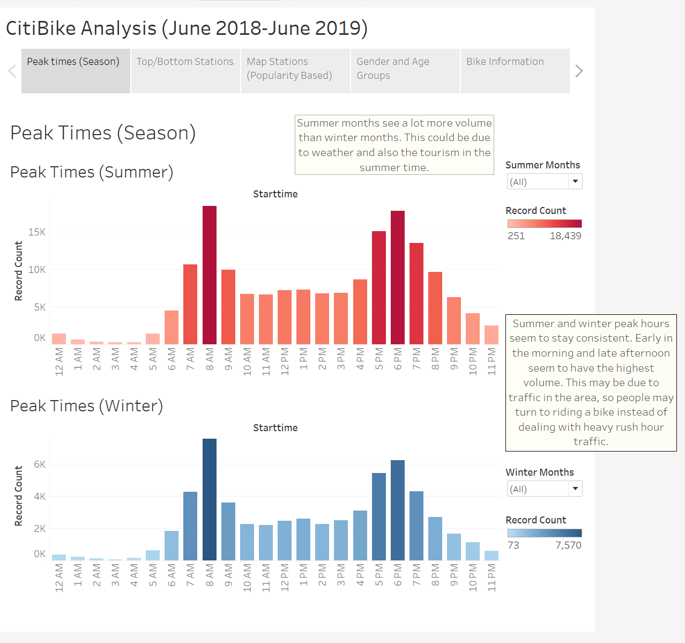
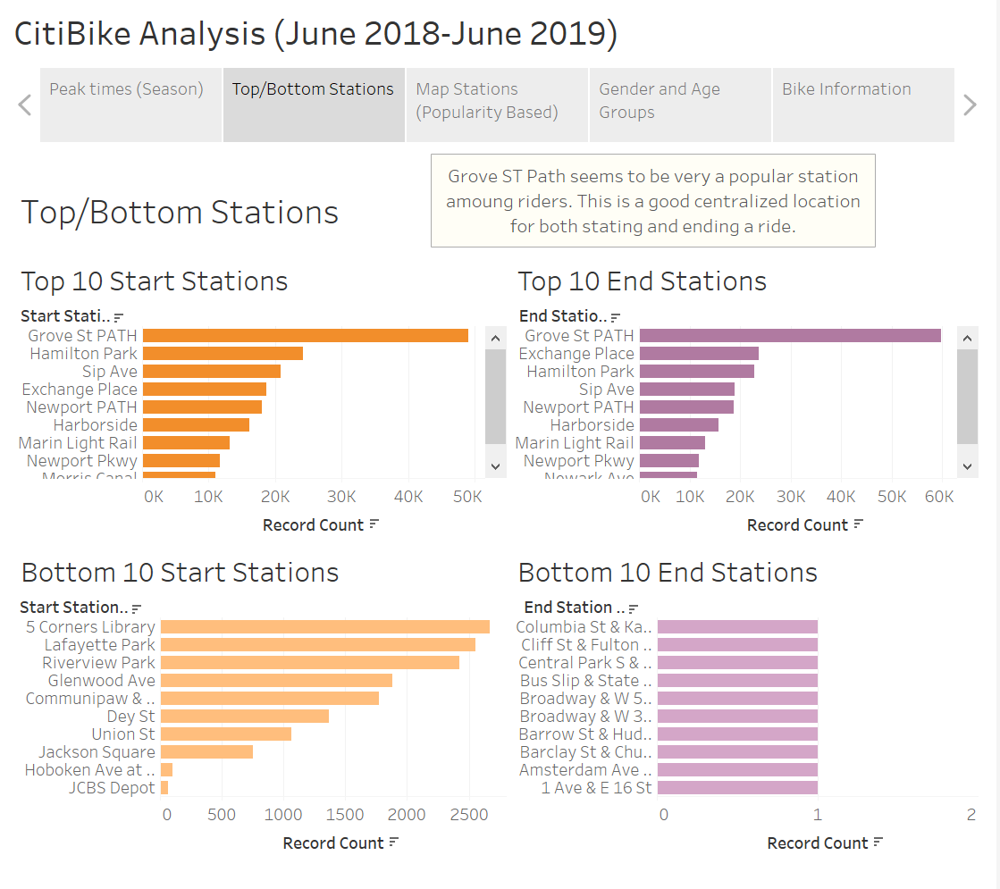
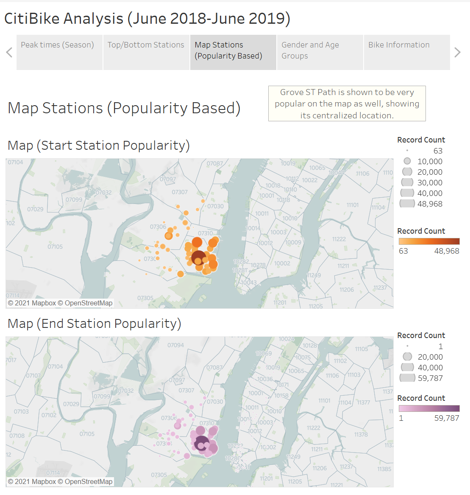
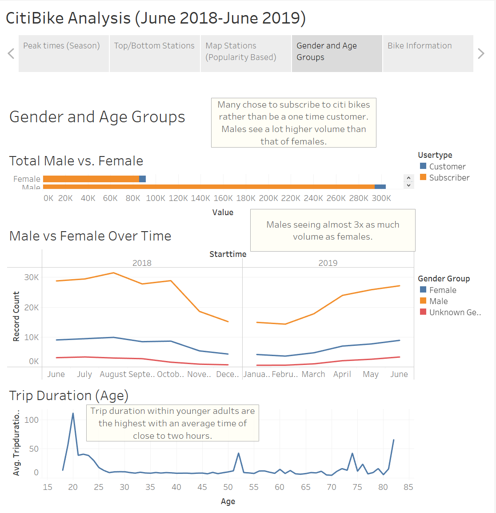
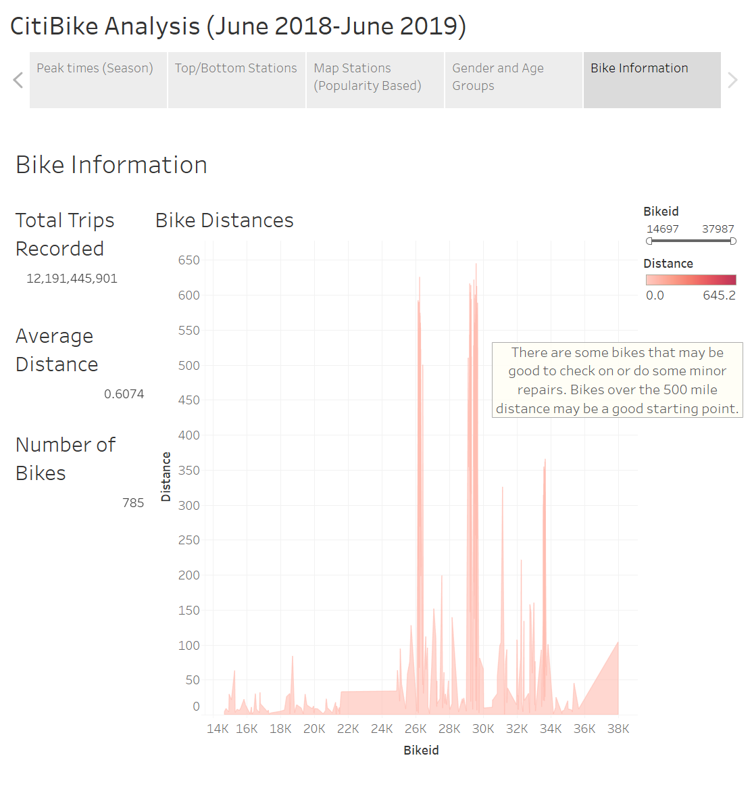

# Public Tableau Workbook
* The full workbook with visuals can be found [here](https://public.tableau.com/profile/alex.martinez2647#!/vizhome/CitibikeData_16206842064520/Analysis?publish=yes) on the public tableau site.

# Data Source:
* The data used is from the [Citi Bike Data](https://www.citibikenyc.com/system-data) webpage. 
* This was then transformed into visualizations to further analyze the CitiBike Data.

# Tools Used
* Tableau
* Python notebook to clean and join the data.

## Research Found within the Data (Analytics with Visuals)
1. Peak times for the Summer and Winter months.
    * In the Summer much more volume is seen. When digging into a couple factors, tourism and weather play the most significant roles. Another note to make is that most of bikers chose to ride during heavy vehicle traffic hours. In the city it may be faster to just go ahead and bike to the riders desired destination rather than sitting in traffic. 

         

2. Top/Bottom 10 Stations for starting and ending points for riders.
    * Grove Street Path is shown to be the most popular station for stating and ending points.

         

3. Map of the popular Stations.
    * A map of the popular stations shows the more centralized the location, the more "in demand" it seems to be. The location of the stations plays a significant role in the amount of rider traffic.

         

4. Gender and Age information.
    * A positive note to make is there are a lot more subscribers than one time customers for the Citibike rentals. This means repeat riders and satisfied customers. 
    * Male riders are a lot more common than female riders as shown in the data visual. It is 3 times more likely that a male will be seen on a Citibike than a female.
    * Younger adults (20-25) see a higher trip duration then that of older adults (55+).

         

5. Bike Statistics.
    * There was high amount of trips recorded within the year span of data reviewed. Although there are over 12 billion trips recorded, there were only 785 distinct bikes used. This data shows it may be time to keep an eye on maintaing the bikes and keeping customers happy. Bikes ridden over the 400-500 mile range should be the top priority. 

         

